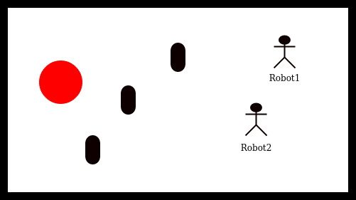
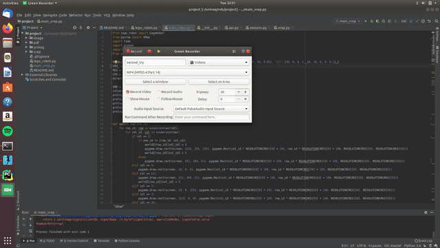

# Robotics project for ISR lab at UNIVAQ Italy

Content:

- [Description](#description)
- [File structure](#file-structure)
- [Robots](#robots)
- [AI](#ai)
- [Prolog](#prolog)
- [Results](#results)

# Description

This is project made as final project for ISR lab. The task of the robot
is to navigate through field, detect obstacle, map the field and find a
red spot somewhere in the field. Example of the field can be seen in
Figure below and the whole assigment is described in [Assigment PDF](pdf/robotics.pdf).  

# File structure

Files are structured in folders, corresponding to their purpose.

**Folders:**

  - Main folder - includes files with AI of the robots,
    one file ([main_vrep.py](AIs/main_vrep.py)) for the simulated robot and
    second file ([main_robot.py](AIs/main_robot.py)) for the real lego robot.
  - [robots](robots) - includes class for the robot, again
    one ([lego_robot_vrep.py](robots/lego_robot_vrep.py)) for the
    simulated robot and second one ([lego_robot.py](robots/lego_robot.py))
    for the real robot
  - [prolog](prolog) - includes [prolog .pl](prolog/state_machine.pl)
    file, which includes the logic for robot behaviour in the field.
  - [vrep](vrep) - includes VREP [scene](vrep/scene.ttt) and
    [image](vrep/vrep1x1.jpg) of the playing field.
  - [odometrium](odometrium) - includes the class for robot odometry.
    From [Odometrium](https://github.com/sterereo/odometrium).
  - [pdf](pdf) - includes [PDF assignment](pdf/robotics.pdf).
  - [image](image) - includes the images for readme and PDF.
  - [videos](videos) - includes the video of simulated run ([vrep.mp4](videos/vrep.mp4))
    and video of the real run ([real.mp4](videos/real.mp4)). The folder includes also the GIF version
    of videos.

# Robots

Both of the robots have the same possible commands. The only difference
is that real robot allows to insert time of the command and the simulated
robot does not.

**List of commands (in version for real robot):**

  - move_forward(speed, time) - moves robot forward.
  - move_backward(speed, time) - moves robot backward.
  - rotate_right(speed, time) - rotates robot right, on place.
  - rotate_left(speed, time) - rotates robot left, on place.
  - stop() - stops the robot.
  - color() - returns color which is being seen by the color sensor. In
    intensity from 0 to 100.
  - touch_right(), touch_left() - returns state of the right/left touch
    sensor. As 1 (pressed), 0(non-pressed)
  - position() - returns the position of the robot. Array \[x,y\], in metres.

# AI

The behaviour of the robot is divided in two steps:

  - Follow the line - robot follows the line, until he come back to the
    start position.
  - Run from corner to corner - robot runs from bottom corner of the map
    to the upper corner of the map. In this part it does these things:
    - Mapping the field - add free position and position of obstacles
      to the map.
    - Avoiding obstacles - if obstacle if found, robot move to the safe
      position and try to get around it.
    - Looking for final red point - if red is found, robot ends its
      movement.

# Prolog

Prolog is used for the main state machine during robots wandering through
the map. The behaviour is described in [this file](prolog/state_machine.pl).  
The main Python program is communicating with prolog interpreter with
the use of [PySwip](https://github.com/yuce/pyswip) bridge. The position
of the robot is dynamically asserted into prolog knowledge base and
prolog is returning the proper state for state machine.

# Results

Results of the project can be seen in videos below.

**Simulated robot**  

  
**Real robot**  

