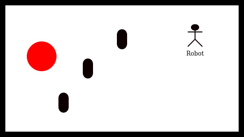

# Robotics project for ISR lab at UNIVAQ Italy

Content:

- [Description](#description)
- [Requirements](#requirements)
- [Installation and run](#installation)
- [File structure](#file-structure)
- [Robots](#robots)
- [AI](#ai)
- [Prolog](#prolog)
- [Results](#results)

# Description

This is project made as final project for ISR lab. The task of the robot
is to navigate through field, detect obstacle, map the field and find a
red spot somewhere in the field. Example of the field can be seen in
Figure below and the whole assignment is described in [Assigment PDF](pdf/robotics.pdf).

Detailed final description and results can be found in [report.pdf](pdf/report.pdf).

# Requirements

- Python3.5+ and basic libraries + NumPy, PyGame
- [VREP simulator](http://www.coppeliarobotics.com/)
- [VREP api](https://github.com/rustlluk/vrep-api-python) - If you have
  already installed this API from AAAI-DISIM-UnivAQ fork, you have to
  download it again, as we added support for touch button.
- [SWI Prolog interpreter](https://www.swi-prolog.org/)
- [PySwip](https://github.com/yuce/pyswip)
- Lego EV3 robot with Debian linux from [EV3DEV](https://www.ev3dev.org/)
- [Odometrium](https://github.com/sterereo/odometrium)

# Installation

Just install all requirements from [Requirements](#requirements) section.

For simulated robot robot:
- run VREP simulator
- load [scene.ttt](vrep/scene.ttt)
- run [main_vrep.py](main_vrep.py)
  - window with PyGame should appear and robot should start to move

For real robot:
- Connect to the robot with tutorials at [EV3Dev](https://www.ev3dev.org/)
- Upload files to robot
- Create a field similar to image in [Description](#description)
- Change field size in [main_robot.py](main_robot.py)
- run [main_robot.py](main_robot.py)

# File structure

Files are structured in folders, corresponding to their purpose.

**Folders:**

  - Main folder - includes files with AI of the robots,
    one file ([main_vrep.py](AIs/main_vrep.py)) for the simulated robot and
    second file ([main_robot.py](AIs/main_robot.py)) for the real lego robot.
  - [robots](robots) - includes class for the robot, again
    one ([lego_robot_vrep.py](robots/lego_robot_vrep.py)) for the
    simulated robot and second one ([lego_robot.py](robots/lego_robot.py))
    for the real robot
  - [prolog](prolog) - includes [prolog .pl](prolog/state_machine.pl)
    file, which includes the logic for robot behaviour in the field.
  - [vrep](vrep) - includes VREP [scene](vrep/scene.ttt) and
    [image](vrep/vrep1x1.jpg) of the playing field.
  - [odometrium](odometrium) - includes the class for robot odometry.
    From [Odometrium](https://github.com/sterereo/odometrium).
  - [pdf](pdf) - includes [PDF assignment](pdf/robotics.pdf).
  - [image](image) - includes the images for readme and PDF.
  - [videos](videos) - includes the video of simulated run ([vrep.mp4](videos/vrep.mp4))
    and video of the real run ([real.mp4](videos/real.mp4)). The folder includes also the GIF version
    of videos.

# Robots

Both of the robots have the same possible commands.

**List of commands:**

  - move_forward(speed, time) - moves robot forward.
  - move_backward(speed, time) - moves robot backward.
  - rotate_right(speed, time) - rotates robot right, on place.
  - rotate_left(speed, time) - rotates robot left, on place.
  - stop() - stops the robot.
  - color() - returns color which is being seen by the color sensor. In
    intensity from 0 to 100.
  - touch_right(), touch_left() - returns state of the right/left touch
    sensor. As 1 (pressed), 0(non-pressed)
  - position() - returns the position of the robot. Array \[x,y\], in metres.

# AI

The behaviour of the robot is divided in two steps:

  - Follow the line - robot follows the line, until he come back to the
    start position.
  - Run from corner to corner - robot runs from bottom corner of the map
    to the upper corner of the map. In this part it does these things:
    - Mapping the field - add free position and position of obstacles
      to the map.
    - Avoiding obstacles - if obstacle is found, robot moves to the safe
      position and tries to get around it.
    - Looking for final red point - if red is found, robot ends its
      movement.

# Prolog

Prolog is used for the main state machine during robots wandering through
the map. The behaviour is described in [this file](prolog/state_machine.pl).  
The main Python program is communicating with prolog interpreter with
the use of [PySwip](https://github.com/yuce/pyswip) bridge. The position
of the robot is dynamically asserted into prolog knowledge base and
prolog is returning the proper state for the state machine.

# Results

More detailed results are described in [report](pdf/report.pdf) pdf file.
Here will be described results just in short points.

**Simulated robot**

Video result of simulated robot can be seen in video below.

- the simulation works well and meets condition of the assignment
- the only problem is that simulation is really dependent on CPU
  processing power
  - added CPU constant to easy adjustments

**Real robot**

The video of real robot can be seen below.

With the real robot more problems occurred:

- We were not able to install Prolog interpreter
  - AI was rewritten to Python for robot
- The odometry on robot is really inaccurate
  - robot is not as accurate as the simulated one
- Color sensor returned strange values sometimes
  - we put it closer to the ground
- Our created field was not really created perfectly

# Future work

In the future, we could focus on these problems:
- Install Prolog interpreter on the robot
- Get test with motors and odometry to get average error and invent some
  way how to face this problem
- Create a better field for the robot, to better test its capabilities
- Find another way how to get data from robot to computer
